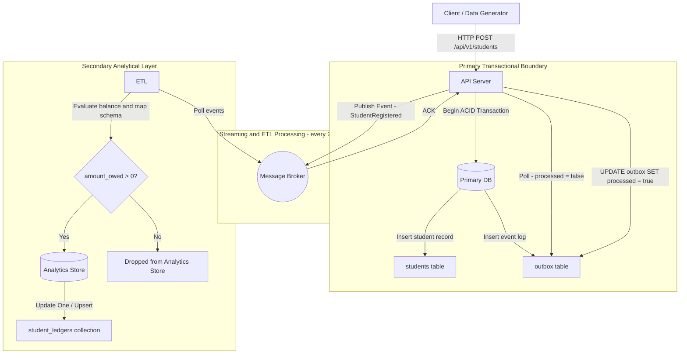
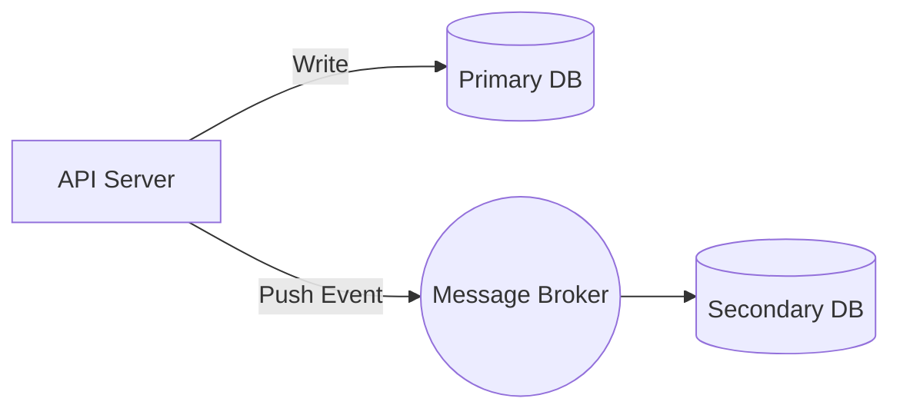
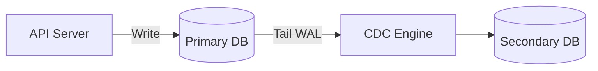
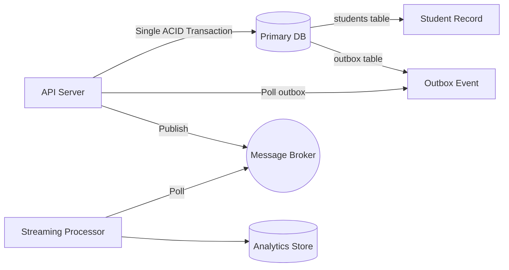
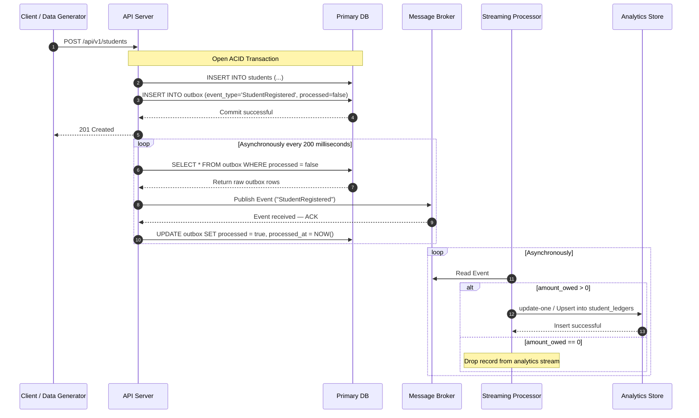

# Music Academy Microservice System — Architecture

**Author:** Mauricio Náñez

This document describes the system architecture, design decisions, schema definitions, and engineering trade-offs for the automated **Music Academy Registration and Analytics Platform**. The system is deployed on **Kubernetes** and operates as an asynchronous, event-driven architecture designed to decouple transactional student registrations from downstream analytical processing.

---

## Table of Contents

1. [System Architecture Overview](#1-system-architecture-overview)
2. [Architectural Design Decisions](#2-architectural-design-decisions)
   - [Option A — Application Dual-Writing](#option-a--application-dual-writing--event-driven-ingestion)
   - [Option B — Change Data Capture (CDC)](#option-b--change-data-capture-cdc)
   - [Option C — Transactional Outbox Pattern ✅ Selected](#option-c--transactional-outbox-pattern--selected)
   - [Comparison Summary](#comparison-summary)
3. [End-to-End Sequence Diagram](#3-end-to-end-sequence-diagram)
4. [Database Schemas](#4-database-schemas)
   - [Primary Store — PostgreSQL](#primary-store--postgresql)
   - [Secondary Store — MongoDB](#secondary-store--mongodb)
5. [Configuration](#5-configuration)
6. [Technology Stack](#6-technology-stack)
7. [Future Roadmap](#7-future-roadmap)

---

## 1. System Architecture Overview



The platform is deployed on **Kubernetes**. The core flow is:

1. A data generator sends student registration events to the API server via `POST /api/v1/students`.
2. The API persists the student record and an outbox event atomically in a single ACID transaction against the primary database.
3. Asynchronously, the API polls the outbox table every **200 milliseconds** and publishes events to the message broker.
4. The outbox row is marked `processed = true` after successful acknowledgement.
5. The streaming processor filters events by `amount_owed > 0` and upserts qualifying records into the analytics store. Records with no outstanding balance are dropped from the analytics stream.

---

## 2. Architectural Design Decisions

Three synchronization patterns were evaluated to bridge data from the primary application layer to the analytics database.

### Option A — Application Dual-Writing / Event-Driven Ingestion

The API server explicitly writes to the primary database and simultaneously pushes an event to a message broker (such as NATS or RabbitMQ).



| | |
|---|---|
| ✅ **Pros** | Decoupled and expressive payloads |
| | Database engine–agnostic |
| | Simpler local and test setup |
| | Better when additional server-side data needs to be injected into the secondary database |
| ❌ **Cons** | The **Dual-Write Consistency Problem** — if the network drops after the DB commits, the event is permanently lost |
| | Increased application complexity |

---

### Option B — Change Data Capture (CDC)

The API server writes only to the primary database. A third-party engine tails the primary database Write-Ahead Log (WAL) to stream every insert instantly.



| | |
|---|---|
| ✅ **Pros** | Guaranteed eventual consistency |
| | Single responsibility for the Go server |
| | No data loss on application crashes |
| | Best option when modularity is essential |
| ❌ **Cons** | Heavy infrastructure footprint |
| | Tight coupling to internal database schema changes |

---

### Option C — Transactional Outbox Pattern ✅ Selected

To avoid consistency issues with the API server writing to the primary database and then immediately trying to communicate with the message broker over the network, it performs both writes inside a **single local ACID database transaction** — one to the `students` table and one to the `outbox` table. An asynchronous process within the server later polls the outbox to safely route events.



| | |
|---|---|
| ✅ **Pros** | **Guaranteed 100% consistency** — no network-induced data loss |
| | Lightweight infrastructure footprint |
| ❌ **Cons** | Database polling overhead on the primary store |
| | Downstream consumers must tolerate **at-least-once delivery** semantics |

---

### Comparison Summary

| Criterion | Option A — Dual-Write | Option B — CDC | Option C — Outbox ✅ |
|---|---|---|---|
| **Data Consistency** | ❌ Risk of split-brain | ✅ Guaranteed | ✅ Guaranteed |
| **Infrastructure Footprint** | 🟡 Moderate | ❌ Heavy | ✅ Lightweight |
| **App Complexity** | ❌ High | ✅ Low | 🟡 Moderate |
| **Best Environment** | Local / Test | Production | Production |
| **DB Engine Agnostic** | ✅ Yes | ❌ No | 🟡 Partial |

---

## 3. End-to-End Sequence Diagram



---

## 4. Database Schemas

### Primary Store — PostgreSQL

Database: `music_academy`

#### `students` table

Stores raw master registration records for enrolled students.

| Column | Type | Description |
|---|---|---|
| `id` | `SERIAL` / `INT` | Primary key, auto-increment |
| `first_name` | `VARCHAR` | Given name |
| `last_name` | `VARCHAR` | Family surname |
| `gender` | `VARCHAR` | Self-identified gender |
| `date_of_birth` | `TIMESTAMP` / `DATE` | Date of birth |
| `inscription_date` | `TIMESTAMP` | Program enrollment timestamp |
| `instrument` | `VARCHAR` | Selected instrument (`vocals`, `guitar`, `piano`, `drums`, `bass`) |
| `program` | `VARCHAR` | Enrollment tier (`basic`, `full`) |
| `amount_owed` | `NUMERIC` / `FLOAT64` | Outstanding balance |
| `last_updated` | `TIMESTAMP` | Last record update timestamp |

**Sample data:**

| id | first_name | last_name | gender | date_of_birth | inscription_date | instrument | program | amount_owed | last_updated |
|---|---|---|---|---|---|---|---|---|---|
| 1 | Mauricio | Nanez | male | 1998-07-01 | 2026-06-01 | vocals | full | 0.0 | 2026-06-02T18:41:00Z |
| 2 | Valeria | Gonzalez | female | 2002-03-01 | 2022-05-15 | vocals | basic | 3000.0 | 2026-06-02T18:41:00Z |
| 3 | Ernesto | Mejilla | male | 2010-01-23 | 2020-09-12 | guitar | full | 5100.0 | 2026-06-02T18:41:00Z |

---

#### `outbox` table

Acts as a transactional event append log polled by the ETL processor.

| Column | Type | Description |
|---|---|---|
| `id` | `BIGSERIAL` | Auto-increment message identifier |
| `event_type` | `VARCHAR` | Event classification (e.g., `StudentRegistered`) |
| `payload` | `JSONB` | Serialized JSON snapshot of student data |
| `processed` | `BOOLEAN` | Processing flag checked by the polling layer |
| `created_at` | `TIMESTAMP` | Event creation timestamp |
| `processed_at` | `TIMESTAMP` (nullable) | Timestamp when the event was acknowledged and cleared |

**Sample row:**

| id | event_type | payload | processed | created_at | processed_at |
|---|---|---|---|---|---|
| 1 | StudentRegistered | `{"id": 64065, "first_name": "Mauricio", "last_name": "Nanez", "gender": "", "instrument": "Piano", "program": "Advanced Composition", "amount_owed": 1500, "date_of_birth": "1998-07-01T00:00:00Z", "inscription_date": "2026-06-04T18:38:21Z", "created_at": "2026-06-04T18:38:21Z"}` | `true` | 2026-06-01T18:41:00Z | 2026-06-01T18:41:20Z |

---

### Secondary Store — MongoDB

Database: `academy_analytics` | Collection: `student_ledgers`

Only students with `amount_owed > 0` are routed to this store. Records are upserted on each event processing cycle.

**Document structure:**

```json
{
  "_id": "ObjectId(...)",
  "student_id": 2,
  "full_name": "Valeria Gonzalez",
  "instrument": "vocals",
  "program": "basic",
  "financials": {
    "amount_owed": 3000.0,
    "status": "unpaid"
  },
  "processed_at": "2026-06-02T18:41:00Z"
}
```

**Sample filtered records (students with outstanding balance):**

| _id | student_id | full_name | instrument | program | financials | processed_at |
|---|---|---|---|---|---|---|
| 6a231 | 2 | Valeria Gonzalez | vocals | basic | `{ "amount_owed": 3000.0 }` | 2026-06-02T18:41:00Z |
| 6a232 | 3 | Ernesto Mejilla | guitar | full | `{ "amount_owed": 5100.0 }` | 2026-06-02T18:41:00Z |

> **Note:** Student #1 (Mauricio Nanez, `amount_owed: 0.0`) is excluded from the secondary store by the Benthos filter.

---

## 5. Configuration

The event generator uses environment variable injection to modify delivery parameters without requiring binary rebuilds.

| Variable | Description | Example Values |
|---|---|---|
| `INGESTION_API_HOST` | Routing address of the cluster ingress API gateway | `http://api.music-academy.svc` |
| `GENERATION_INTERVAL` | Throttle rate for the traffic generation loop | `100ms`, `500ms`, `2s` |

---

## 6. Technology Stack

| Layer | Technology |
|---|---|
| **API Server** | Go |
| **Primary Database** | PostgreSQL 16 |
| **Message Broker** | NATS JetStream |
| **ETL Processor** | Benthos |
| **Analytics Database** | MongoDB |
| **Deployment** | Kubernetes |

---

## 7. Future Roadmap

The following improvements are planned to evolve the platform:

1. **Alert System** — Introduce alerting when data is being sent or processed incorrectly across service boundaries.
2. **Domain Schema Expansion** — Add tables for teachers, entry/dropout records, and richer student profiles (assigned teacher, multiple instruments, course capacity limits).
3. **Transition to Full CDC** — Replace Benthos table polling with a native Debezium CDC log-tailing wrapper to eliminate read overhead on the primary database entirely.
4. **Log Display Levels** — Implement structured, configurable log verbosity levels across all services.
5. **Lexicographically Sortable IDs (UUIDv7)** — Replace integer primary keys with time-ordered UUIDv7 identifiers to improve distributed sorting and indexing performance.
6. **System Sanity Tests** — Add integration and end-to-end test coverage for the full registration and analytics pipeline.
7. **Distributed Telemetry** — Integrate OpenTelemetry interceptors inside Go handlers and NATS headers to enable end-to-end distributed tracing across all service boundaries.
